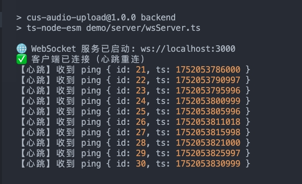

# Cus Audio Upload Demo

本项目为前后端分离的 WebSocket 心跳与重连机制演示，支持音频上传、心跳检测、自动重连、手动重连、服务端故障模拟等功能，带有录音上传的案例，后面没有对音频进行任何处理，只做上传。

## 目录结构

- `demo/App.vue`：前端主页面，包含所有核心逻辑和 UI。
- `demo/server/wsServer.ts`：WebSocket 服务端，支持故障模拟与恢复。
- `src/managers/`：WebSocket、音频等管理类。

## 启动方式

### 1. 安装依赖
```bash
pnpm install
```

### 2. 启动前端服务
```bash
pnpm frontend
```
默认端口：http://localhost:5173/

### 3. 启动后端服务
```bash
pnpm backend
```
默认端口：ws://localhost:3000

> **建议分别在两个命令窗口运行前后端服务，便于调试和测试。**

## 主要功能

- WebSocket 心跳检测与自动重连
- 连续3次心跳重连失败后，页面显示【请手动重连】按钮
- 支持【模拟故障】和【恢复正常】按钮，动态切换服务端 pong 回复
- 所有心跳相关日志均带有“【心跳】”前缀，便于筛查
- 支持音频录制、上传等基础功能

## 测试流程

1. 正常启动前后端服务，前端页面显示“WebSocket 已连接”。
2. 关闭掉后端服务，前端自动重连3次失败后出现【请手动重连】按钮。
3. 可多次反复测试。

## 演示效果

1. 正常效果


断开后端服务，前端自动重连3次失败后出现【请手动重连】按钮




## 常见问题

- 如端口被占用，需先释放 3000 端口（`lsof -i :3000 | xargs kill -9`）。
- 如需调试日志，建议在控制台用“心跳”关键词筛选。

## 依赖
- Vue 3
- Vite
- ws
- ts-node-esm
- pnpm

---
如有其它问题或需求，欢迎随时反馈！ 